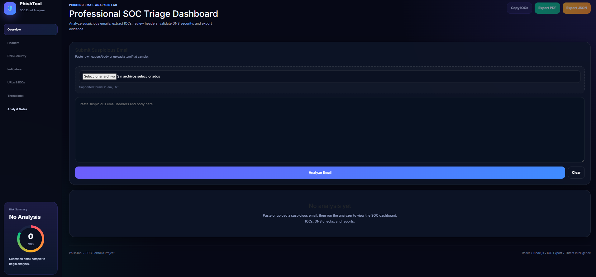
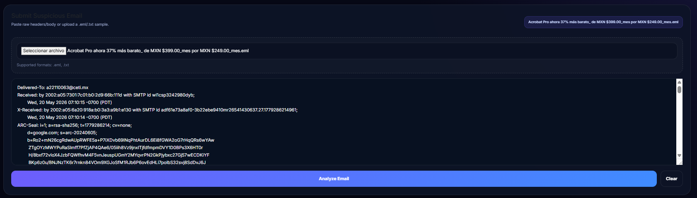
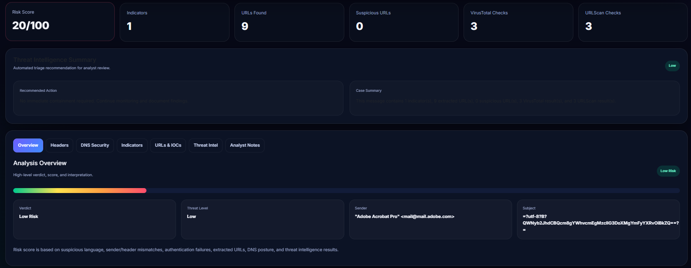
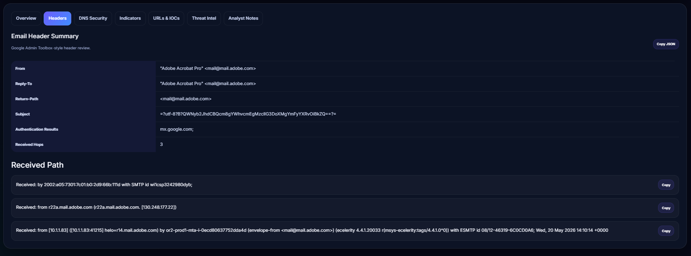
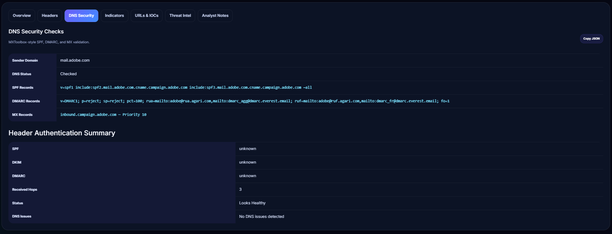
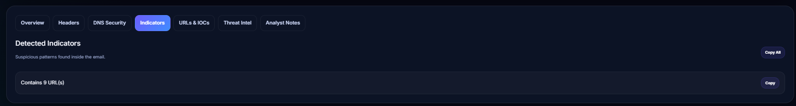
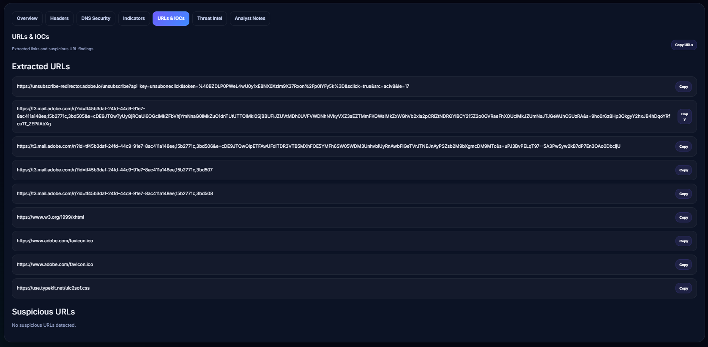
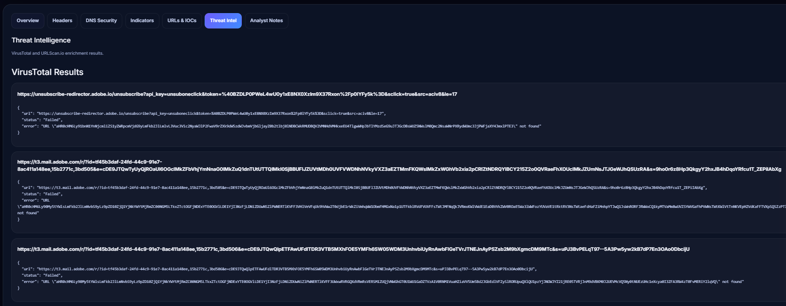
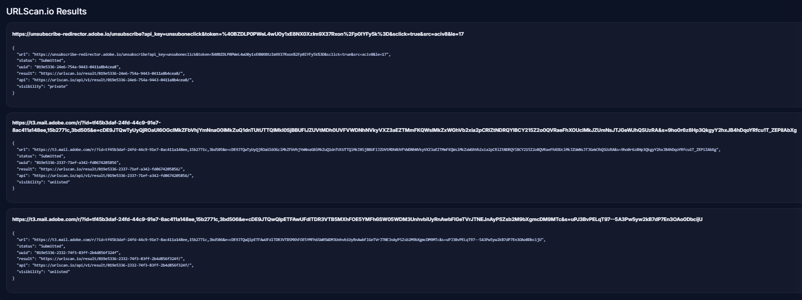
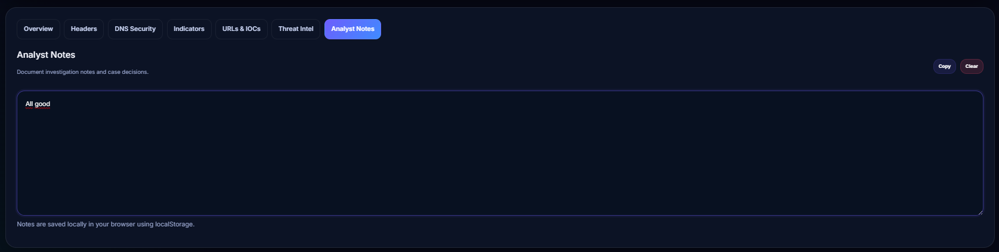

# Phishing Email Analysis Lab

Professional SOC-style phishing email analysis dashboard built with React and Node.js.

---

## Features

- Email phishing analysis
- IOC extraction
- Suspicious URL detection
- Email header parsing
- SPF / DKIM / DMARC validation
- DNS security checks
- VirusTotal integration
- URLScan.io integration
- Analyst notes system
- IOC export (JSON)
- PDF report export
- SOC dashboard UI
- Responsive modern frontend

---

## Security Analysis Features

### MXToolbox-style DNS Analysis

The platform performs domain reputation and email security validation similar to MXToolbox by checking:

- SPF records
- DMARC policies
- MX records
- Sender domain validation
- DNS configuration issues
- Mail routing information

### Google Admin Toolbox-style Header Analysis

The application analyzes raw email headers similar to Google Admin Toolbox:

- Authentication-Results parsing
- SPF validation
- DKIM validation
- DMARC verification
- Received hops analysis
- Return-Path inspection
- Reply-To mismatch detection
- Header anomaly detection

### Threat Intelligence

Integrated threat intelligence sources include:

- VirusTotal URL reputation analysis
- URLScan.io URL inspection
- IOC extraction and investigation
- Suspicious link detection
- Automated phishing indicators

### SOC Workflow Features

- Analyst notes system
- IOC copy/export functionality
- JSON report export
- PDF investigation reports
- SOC dashboard visualization
- Risk scoring system

---

## Tech Stack

### Frontend

- React
- CSS3
- Axios
- jsPDF
- Vite

### Backend

- Node.js
- Express
- DNS utilities
- VirusTotal API
- URLScan API

---

## Installation

Clone repository:

```bash
git clone https://github.com/JLedezB/phishing-email-analysis-lab.git
```

Install frontend dependencies:

```bash
cd frontend
npm install
```

Install backend dependencies:

```bash
cd ../backend
npm install
```

---

## Environment Variables

Create `.env` inside backend folder:

```env
VIRUSTOTAL_API_KEY=your_api_key
URLSCAN_API_KEY=your_api_key
PORT=5000
```

---

## Run Backend

```bash
cd backend
npm run dev
```

---

## Run Frontend

```bash
cd frontend
npm run dev
```

---

## Project Structure

```txt
phishing-email-analysis-lab/
│
├── frontend/
│   ├── src/
│   │   ├── App.jsx
│   │   ├── style.css
│   │   └── main.jsx
│   │
│   └── package.json
│
├── backend/
│   ├── server.js
│   ├── package.json
│   └── .env
│
└── README.md
```

---

## Screenshots

### Main Dashboard



### Submit Suspicious Email



### Risk Overview



### Email Header Summary



### DNS Security & Header Authentication



### Indicators Detected



### URLs & IOCs



### Threat Intelligence



### URLScan Results



### Analyst Notes



---

---

## Portfolio Project

This project demonstrates:

- SOC investigation workflow
- Phishing analysis
- Threat intelligence integration
- IOC handling
- Frontend dashboard design
- Incident documentation
- Cybersecurity tooling

---

## Author

Joaquin Ledezma Barragan / SOC Analyst Portfolio Project

